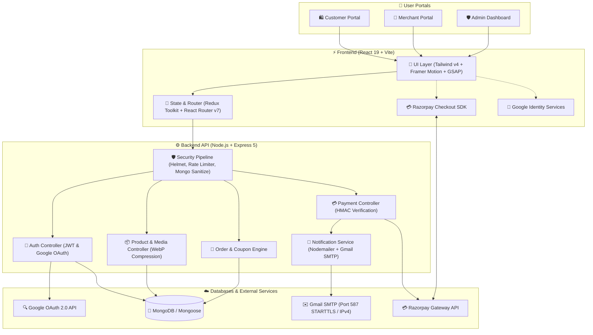

# ✨ NovaCart — Premium MERN E-Commerce Platform

NovaCart is a state-of-the-art, enterprise-ready e-commerce platform built on the MERN (MongoDB, Express, React, Node.js) stack. It features a premium, ultra-responsive user interface with rich micro-animations, role-based user portals, automated WebP/MP4 media compression, multi-recipient notification emails, smart discount coupon calculations, and production-grade security.

Live Production URL: **[https://novacart-arghya876.vercel.app/](https://novacart-arghya876.vercel.app/)**

---

## 📖 About NovaCart

NovaCart is designed to provide a seamless end-to-end shopping and management experience for Customers, Merchants, and Administrators.

### 🌟 Key Highlights & Features

- **🔐 Multi-Portal Authentication & Google Sign-In**: Dedicated, role-isolated portals for Customers (`/login/customer`), Merchants (`/login/seller`), and Admins (`/admin/login`) with Google OAuth 2.0 integration via Google Identity Services.
- **💳 Multi-Method Razorpay Payment Gateway**: Seamless end-to-end checkout supporting Instant UPI (Google Pay, PhonePe, Paytm, BHIM), Credit & Debit Cards (Visa, Mastercard, RuPay, Amex), NetBanking (50+ banks), Flexible EMI options, and Digital Wallets with real-time payment status tracking.
- **📧 Automated Gmail Notification Engine**: Production-ready email system powered by Nodemailer & Google Gmail SMTP (Port 587 STARTTLS with explicit IPv4 socket routing), delivering branded HTML notifications for Account Activation OTPs, Password Resets, Customer Invoices, Seller Sale Alerts, Delivery Status Updates, Contact Us Support Inquiries, and Account Deletion OTPs.
- **🏷️ Smart Discount Coupon Calculation**: Advanced coupon calculation engine supporting dynamic percentage discounts, fixed value reductions, minimum cart thresholds, expiration checks, and live cart total adjustments.
- **🔍 Animated Floating Search & Real-Time Autocomplete**: Glassmorphic search overlay with debounced API queries, instant suggestions, thumbnail previews, and tag filtering.
- **🖼️ Automatic WebP Image & Video Compression**: Automated client/server media optimization converting uploaded product images to lightweight WebP format for high-speed page loads.
- **🚚 Live Order Tracking & Management**: Interactive visual status tracker (`Order Placed` ➔ `Processing` ➔ `Shipped` ➔ `Out for Delivery` ➔ `Delivered`) with multi-recipient status update emails sent to Customer, Seller, and Admin.
- **🛡️ Enterprise-Grade Security**: Hardened HTTP headers via Helmet CSP directives, rate limiting, MongoDB query sanitization, HTTP-Only JWT cookies, and bcrypt password hashing.

---

## 🏗️ System Architecture

NovaCart follows a decoupled, highly scalable client-server architecture. The diagram below illustrates the end-to-end flow between user portals, front-end state management, backend controllers, payment gateways, and external cloud services:

---

## 🚀 Technology Stack

### Frontend
- **Framework:** React 19 & Vite 8 (Ultra-fast modern build tooling)
- **State Management:** Redux Toolkit & React Redux
- **Styling:** Tailwind CSS v4 (Custom design system & fluid dark mode)
- **Animations:** Framer Motion & GSAP (Interactive micro-animations & spring overlays)
- **Icons:** Lucide React
- **SEO & Routing:** React Helmet Async & React Router v7

### Backend
- **Runtime & Framework:** Node.js & Express 5
- **Database:** MongoDB (via Mongoose) with `mongodb-memory-server` fallback
- **Authentication:** JWT (Access & Refresh tokens via HTTP-Only Cookies) + Google Identity Services (OAuth 2.0)
- **Payment Processing:** Razorpay Integration (UPI, Credit/Debit Cards, NetBanking, EMI, Wallets & Secure verification)
- **Email Notifications:** Nodemailer (`nodemailer` v6+) + Google Gmail SMTP (Port 587 STARTTLS, IPv4 forced, Google App Passwords & branded HTML templates)
- **Media Processing:** Client/Server WebP conversion & compressed storage
- **Security:** Helmet CSP, Express Rate Limit, Mongo Sanitize, CORS lockdown, bcryptjs

---

## ⚖️ Pros and Cons

### Pros
- **⚡ High Performance & Speed:** Optimized modern build stack with React 19, Vite, and client-side WebP compression for rapid page loading.
- **💳 Multi-Method Secure Payments:** Integrated Razorpay checkout supporting Instant UPI, Cards, Netbanking, EMI, and Wallets with cryptographic verification.
- **📧 Live Gmail Notification Engine:** Production-grade email automation using Gmail SMTP (Port 587 STARTTLS & IPv4 routing) for OTPs, order invoices, status tracking, and support inquiries.
- **🎨 Premium UI/UX & Aesthetics:** Modern glassmorphism design, fluid dark mode, and micro-animations with GSAP and Framer Motion.
- **🔒 Robust Role-Based Security:** Strict separation of Customer, Seller, and Admin portals backed by JWT access/refresh tokens and sanitized API routes.
- **💸 Smart Coupon & Discount Logic:** Flexible discount calculation system with automated validation, percentage/fixed savings, and live cart updating.
- **📲 Responsive & Cross-Device Ready:** Mobile-first layout with smooth navigation, floating search, and interactive order tracking.

### Cons
- **⏳ Free Cloud Host Spin-Down:** Free server tiers (e.g. Render free instance) may spin down after 15 minutes of inactivity, causing a short initial spin-up delay on cold requests.
